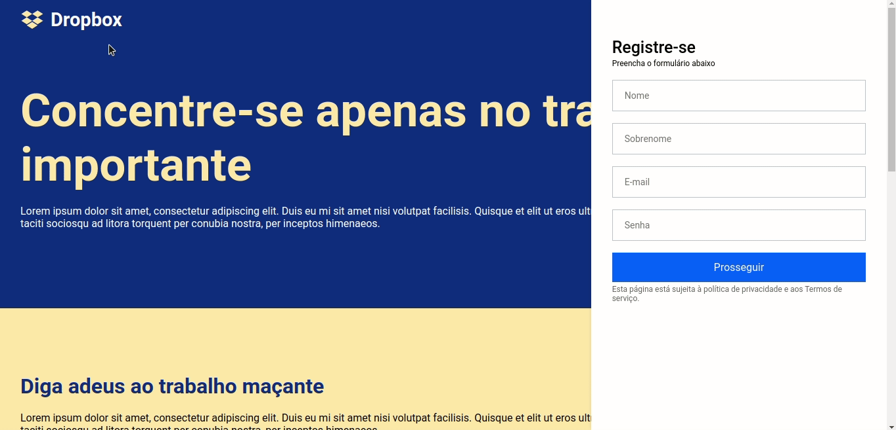
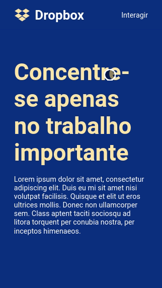

<h1 align="center" >
  
  <br>
  <br>
  Dropbox
</h1>

<h4 align="center">
  Clone from Dropbox web site
</h4>

<p align="center">
  <a href="#rocket-technologies">Technologies</a>&nbsp;&nbsp;&nbsp;|&nbsp;&nbsp;&nbsp;
  <a href="#information_source-how-to-use">How To Use</a>
</p>

<p align="center">
  
</p>

<p align="center">
  
</p>

## :rocket: Technologies

This project was developed with the following technologies:

-  [ReactJS](https://reactjs.org/)
-  [Styled-components](https://styled-components.com/)
-  [React Icons](https://react-icons.github.io/react-icons/)

## :information_source: How To Use

To clone and run this application, from your command line:

```bash
# Clone this repository
$ git clone https://github.com/guilhermeulbriki/clone-dropbox.git

# Go into the repository
$ cd clone-dropbox

# Install dependencies
$ yarn

# Open on browser
$ yarn start
```
